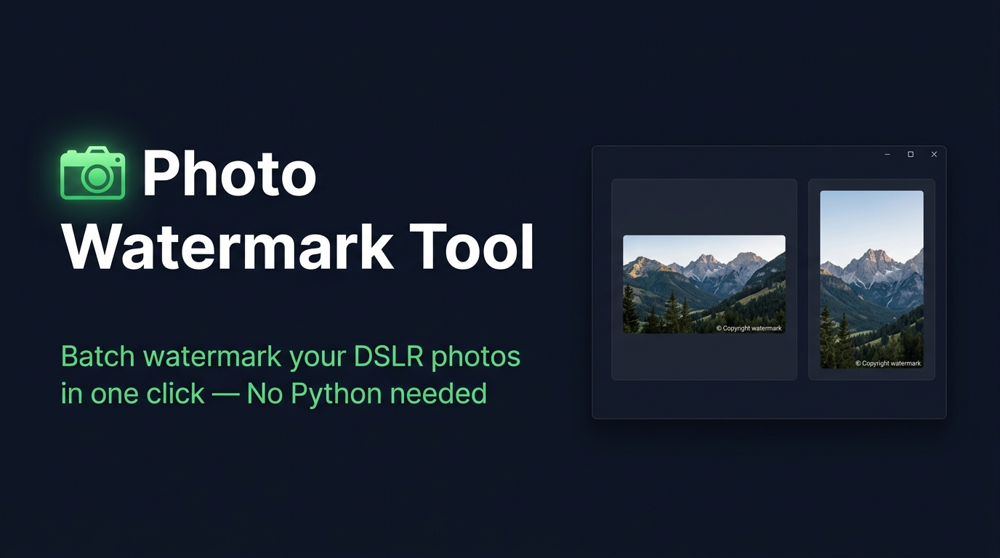

<div align="center">
  
  <br/><br/>

  <a href="../../releases/latest/download/PhotoWatermark.exe">
    
  </a>
  &nbsp;
  
  &nbsp;
  
  &nbsp;
  

  <br/><br/>

  <h3>Batch watermark your DSLR photos in one click.<br/>No Python. No installation. No technical knowledge required.</h3>
</div>

---

## ✨ Features

| | |
|---|---|
| 📷 **Batch Processing** | Watermarks all photos in the same folder automatically |
| 🖼️ **Live Preview** | See exactly how your watermark looks on both landscape and portrait photos before processing |
| ✏️ **Custom Text** | Type any watermark text you want |
| 📍 **5 Positions** | Bottom Right · Bottom Left · Top Right · Top Left · Center |
| 🔠 **Font Size Control** | Drag a slider from 1% to 8% of image width — scales perfectly on any photo size |
| 🎨 **Color Picker** | Full color wheel + one-click presets: White, Black, Yellow, Red, Blue |
| 🔆 **Opacity Slider** | Ghost-light (20) to fully solid (255) |
| 💾 **Settings Memory** | Remembers your last watermark text, color, position and opacity |
| 🔒 **Originals Safe** | Watermarked copies go into a `watermark/` subfolder — your originals are never touched |
| ⚡ **Instant & Free** | Single `.exe` file, no installation, no subscription, works offline |

---

## 📥 Download

<div align="center">
  <a href="../../releases/latest/download/PhotoWatermark.exe">
    
  </a>
  <br/><br/>
  <b>Windows 10 / 11 &nbsp;•&nbsp; 64-bit &nbsp;•&nbsp; ~31 MB &nbsp;•&nbsp; No installation needed</b>
</div>

---

## 🚀 How to Use

> **It's 3 steps. That's it.**

```
Step 1 — Copy PhotoWatermark.exe into the folder with your photos

Step 2 — Double-click PhotoWatermark.exe

Step 3 — Customise your watermark and click ▶ Start Watermarking
```

### What happens:

```
📁 Your Photo Folder\
   ├── IMG_001.jpg
   ├── IMG_002.jpg          ← Your originals — never touched
   ├── IMG_003.png
   ├── PhotoWatermark.exe
   └── 📁 watermark\        ← Auto-created!
        ├── IMG_001.jpg     ← Watermarked copy ✅
        ├── IMG_002.jpg     ← Watermarked copy ✅
        └── IMG_003.png     ← Watermarked copy ✅
```

---

## 🖼️ App Interface

The app opens a clean, dark-themed window with two panels:

**Left panel — Settings**
- Type your watermark text
- Choose position from dropdown
- Adjust font size with a slider
- Pick any color or use quick presets
- Set opacity

**Right panel — Live Preview**
- See your watermark rendered on a realistic landscape photo **(3:2 DSLR ratio)**
- See it simultaneously on a portrait photo **(2:3 DSLR ratio)**
- Updates instantly as you change any setting

---

## 📋 Supported Formats

| Format | Read | Write |
|---|---|---|
| `.jpg` / `.jpeg` | ✅ | ✅ |
| `.png` | ✅ | ✅ |
| `.bmp` | ✅ | ✅ |
| `.webp` | ✅ | ✅ |

---

## ❓ FAQ

**Do I need to install Python?**
No. The `.exe` is fully standalone and runs on any Windows 10/11 PC.

**Will it overwrite my original photos?**
Never. All watermarked photos are saved into a `watermark/` subfolder. Your originals stay untouched.

**Can I use it on different folders?**
Yes. Just copy the `.exe` into any folder with photos and double-click it. It always processes the folder it's sitting in.

**Does it remember my settings?**
Yes. A small `watermark_config.json` file is saved next to the `.exe` with your last-used settings. It loads automatically next time.

**Will it work on large DSLR photos (20+ megapixels)?**
Yes. The font size automatically scales relative to image width, so it looks great on any size.

---

## 🛡️ License

MIT License — free to use, share and modify.

---

<div align="center">
  Made with ❤️ &nbsp;•&nbsp; Built for non-technical users &nbsp;•&nbsp; Zero friction photo watermarking
</div>
